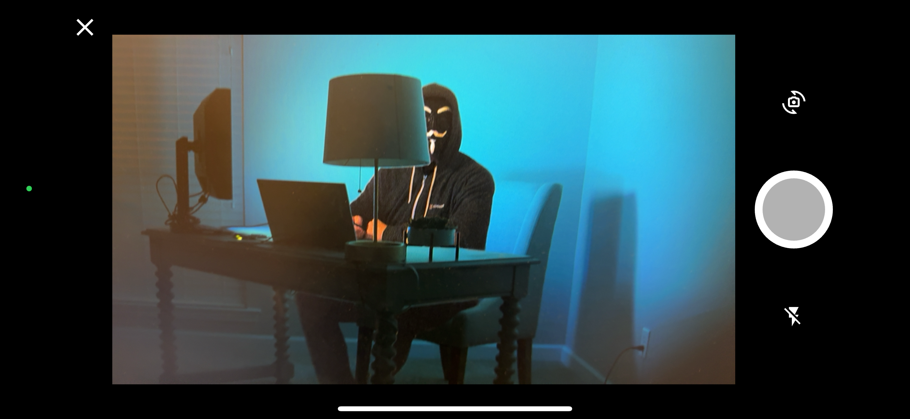

# EasyCamera

Flutter EasyCamera is a Flutter plugin that simplifies camera integration with customizable configurations. It provides a flexible and intuitive interface for capturing images while allowing developers to configure camera settings, preview styles, and control visibility.

## Features
- Initialize and fetch available cameras
- Customize camera controls (flash, switch camera, capture, close button, etc.)
- Configure preview scaling
- Set image resolution
- Enable debug logs
- Handle captured images with callbacks

## Installation

Add the dependency in your `pubspec.yaml`:
```yaml
dependencies:
  easy_camera: latest_version
```

Then, run:
```sh
flutter pub get
```

## Usage

### 1. Initialize EasyCamera
Before using the camera, initialize it after ensuring Flutter bindings are initialized:

```dart
void main() async {
  WidgetsFlutterBinding.ensureInitialized();
  await EasyCamera.initialize(printLogs: true);
  runApp(const MyApp());
}
```

### 2. Configure the Camera
Create a `CameraConfig` instance to customize camera settings:

```dart
final CameraConfig config = CameraConfig(
  imageResolution: ImageResolution.high,
  defaultCameraType: CameraType.front,
  defaultFlashType: CameraFlashType.off,
  showControls: true,
  showCaptureIcon: true,
  showFlashControl: true,
  showCameraSwitchIcon: true,
  showCloseIcon: true,
  cameraPreviewSize: CameraPreviewSize.fill,
  focusColor: Colors.blue,
  showImagePreview: true,
);
```

### 3. Open Camera View
Use `EasyCamera.cameraView` to display the camera:

```dart
EasyCamera.cameraView(
  config: config,
  onCapture: (XFile? file) async {
    if (file != null && context.mounted) {
      Navigator.pop(context, file);
    }
  },
);
```

## Preview

### Portrait Mode


### Landscape Mode


## Camera Configuration

The `CameraConfig` class allows customization of various camera settings:

```dart
const CameraConfig({
  this.imageResolution = ImageResolution.medium,
  this.defaultCameraType = CameraType.front,
  this.defaultFlashType = CameraFlashType.off,
  this.showControls = true,
  this.showCaptureIcon = true,
  this.showFlashControl = true,
  this.showCameraSwitchIcon = true,
  this.showCloseIcon = true,
  this.captureIcon,
  this.cameraSwitchIcon,
  this.flashControlBuilder,
  this.closeIcon,
  this.cameraPreviewSize = CameraPreviewSize.fill,
  this.minAvailableZoom = 1.0,
  this.maxAvailableZoom = 1.0,
  this.focusColor = Colors.white,
  this.showImagePreview = true,
});
```

### Available Options
| Parameter                | Description                                      |
|--------------------------|--------------------------------------------------|
| `imageResolution`        | Image resolution (low, medium, high)             |
| `defaultCameraType`      | Front or back camera                             |
| `defaultFlashType`       | Flash mode (on, off, auto)                       |
| `showControls`           | Show or hide all camera controls                 |
| `showCaptureIcon`        | Show capture button                              |
| `showFlashControl`       | Show flash toggle button                         |
| `showCameraSwitchIcon`   | Show switch camera button                        |
| `showCloseIcon`          | Show close button                                |
| `cameraPreviewSize`      | Preview scaling (fill, fit)                      |
| `minAvailableZoom`       | Minimum zoom level                               |
| `maxAvailableZoom`       | Maximum zoom level                               |
| `focusColor`             | Color of the focus indicator                     |
| `showImagePreview`       | Show preview after capturing an image            |

### Camera Preview Size Enum

```dart
enum CameraPreviewSize { fill, normal }

extension CameraPreviewSizeExtension on CameraPreviewSize {
  double get scale {
    return switch (this) {
      CameraPreviewSize.normal => 5 / 7,
      CameraPreviewSize.fill => 0,
    };
  }
}
```

### Logging
To enable logs, set `printLogs: true` during initialization.

```dart
await EasyCamera.initialize(printLogs: true);
```

## License
This project is licensed under the MIT License. Feel free to use and modify it as needed.
